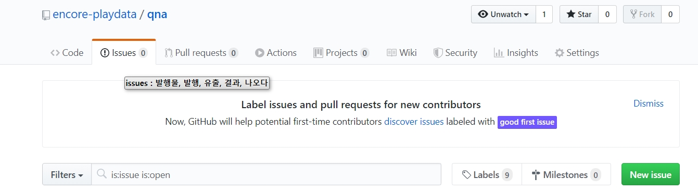
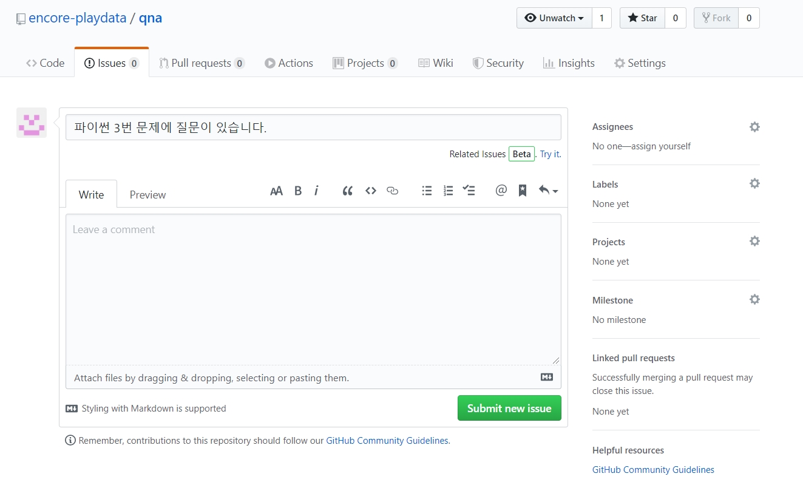
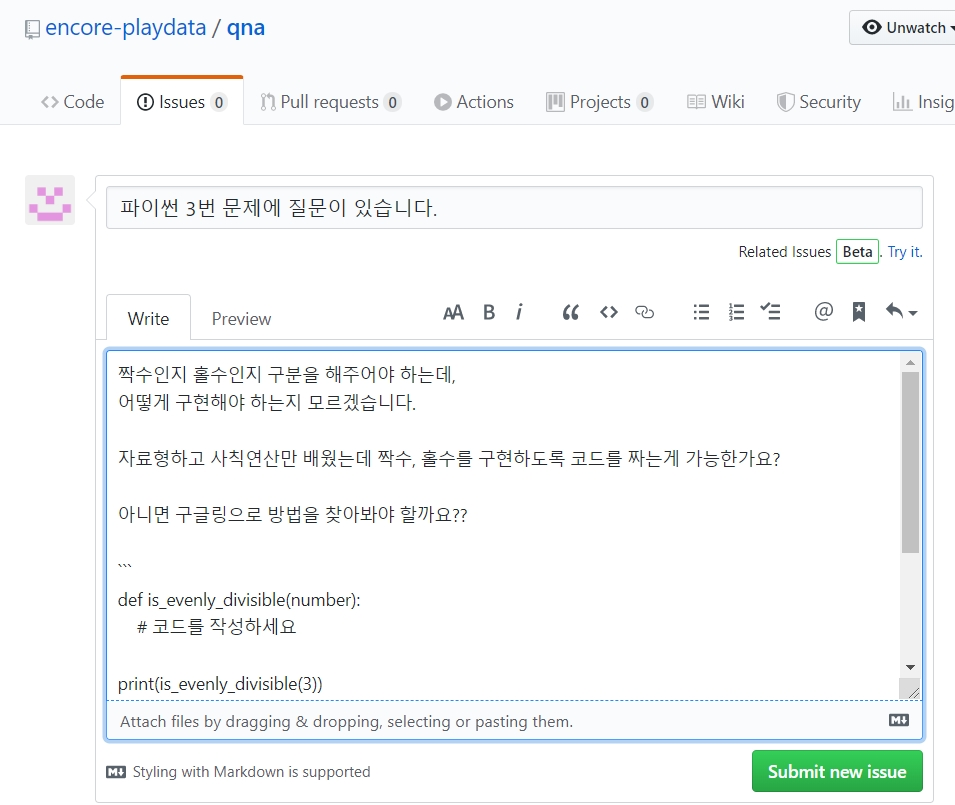
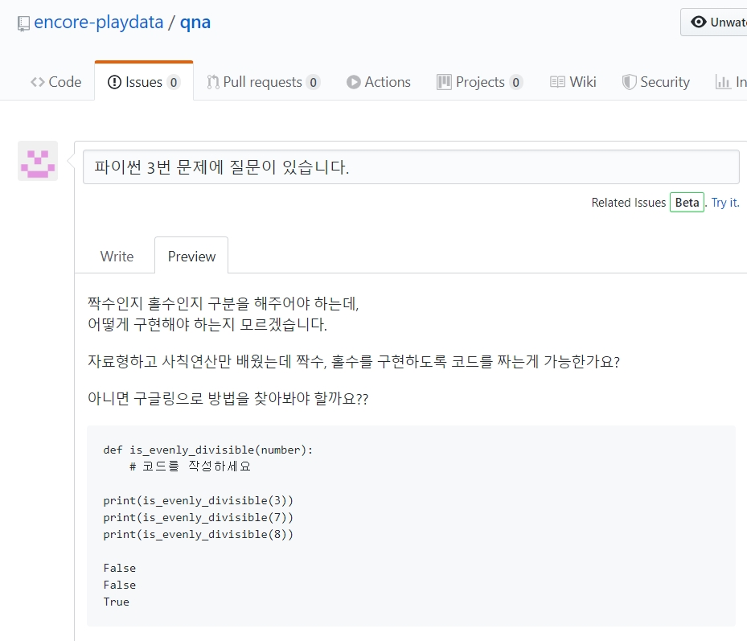
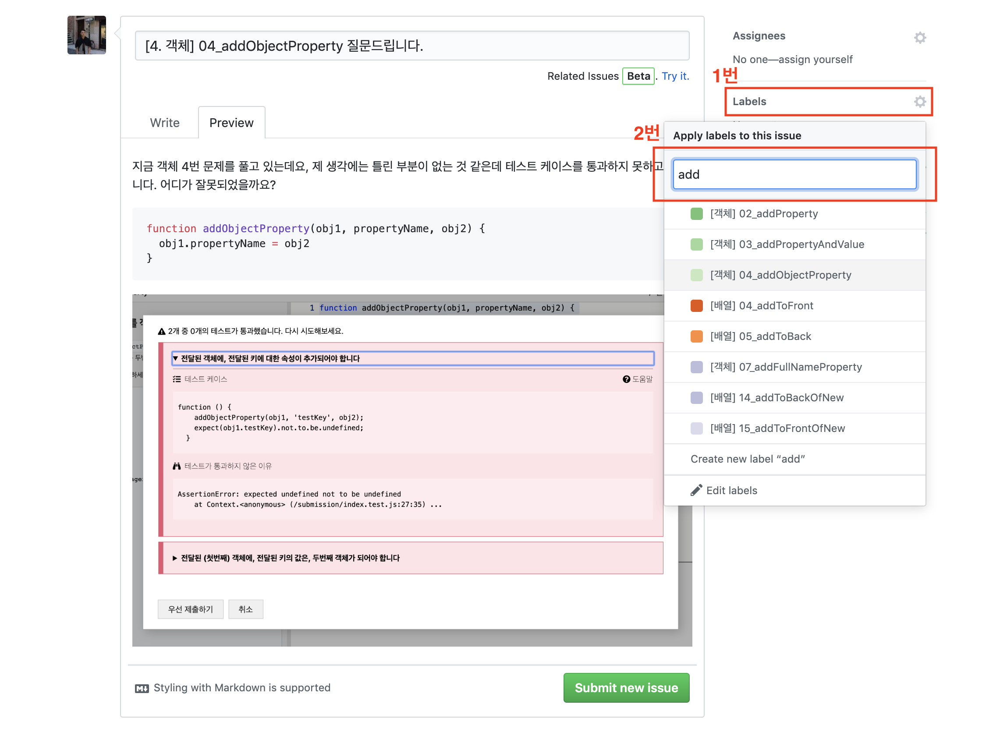
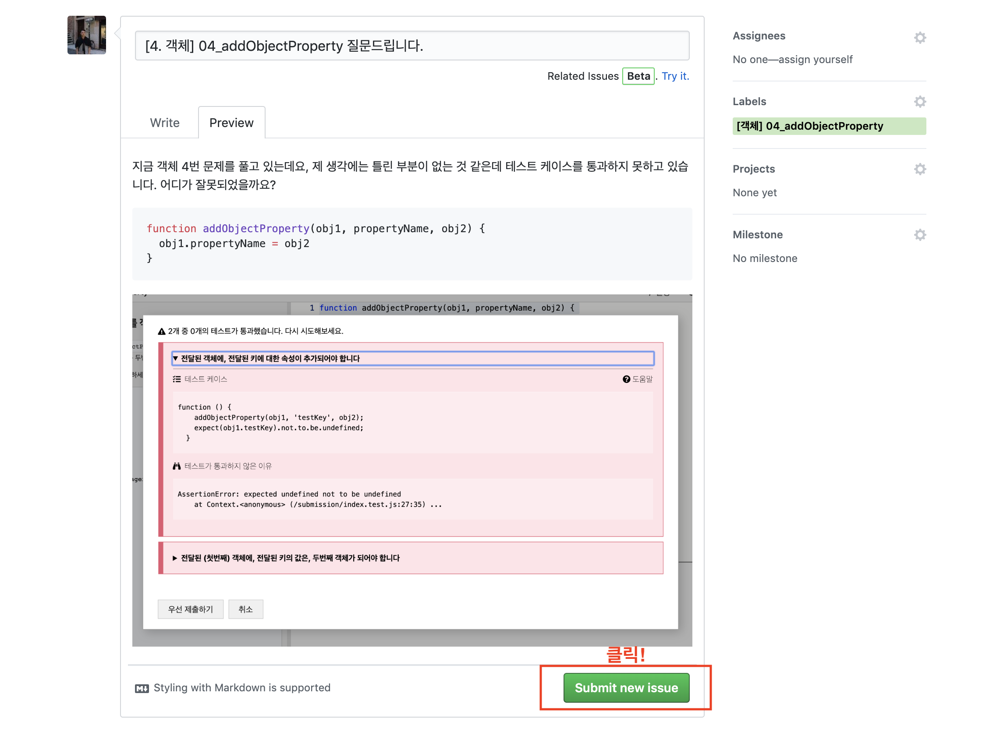

# ✔ qna 게시판 사용법 안내
 

### 1. 메뉴에서 Issues 탭을 클릭하세요.

 

### 2. 'New Issue' 버튼을 클릭하세요. 

 

### 3. 질문 제목을 적어주세요

`New issue` 버튼을 누르면 아래와 같이 새로운 질문을 작성할 수 있는 창이 뜹니다. 
맨 위에 있는 빈칸에 질문할 내용의 제목을 입력합니다.

 

### 4. 질문 내용 작성하기

질문할 내용을 작성합니다. 

 

### 5. 미리보기

`Preview`를 눌러 질문이 잘 작성되었는지 확인하세요.

 

### 6. 라벨 달기

질문에 라벨을 달면 라벨별로 편하게 검색을 할 수 있습니다.
나중에 다른 분들이 어려움에 처했을 때 여러분들의 질문을 보고 도움을 얻을지도 모릅니다.
함께 학습하는 다른 분들을 위해 꼭 라벨을 달아주세요!

* 먼저, 글 작성하는 곳 우측에 있는 `Label`을 클릭합니다
* 다음 문제 제목을 검색하고 맞는 라벨을 달아줍니다.

 

### 7. 질문을 만듭니다.

위의 단계를 모두 완료했다면, `Submit new issue` 버튼을 클릭해 질문을 만들어 주시면 됩니다!

