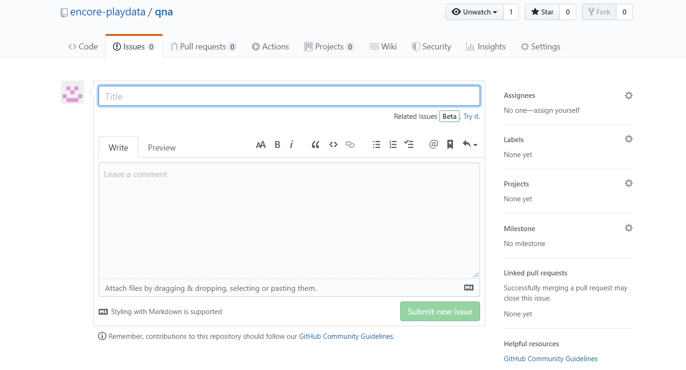
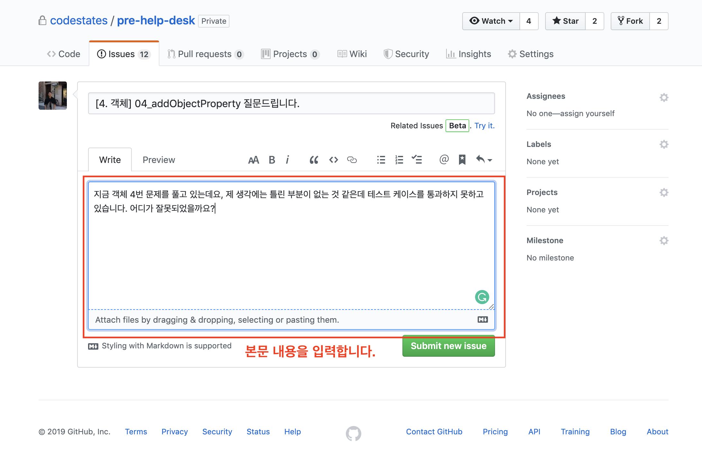
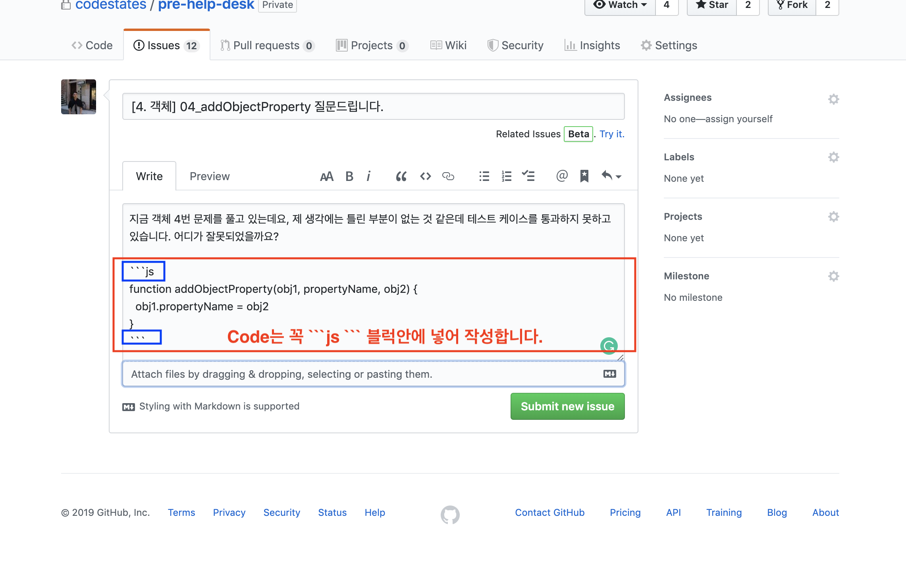
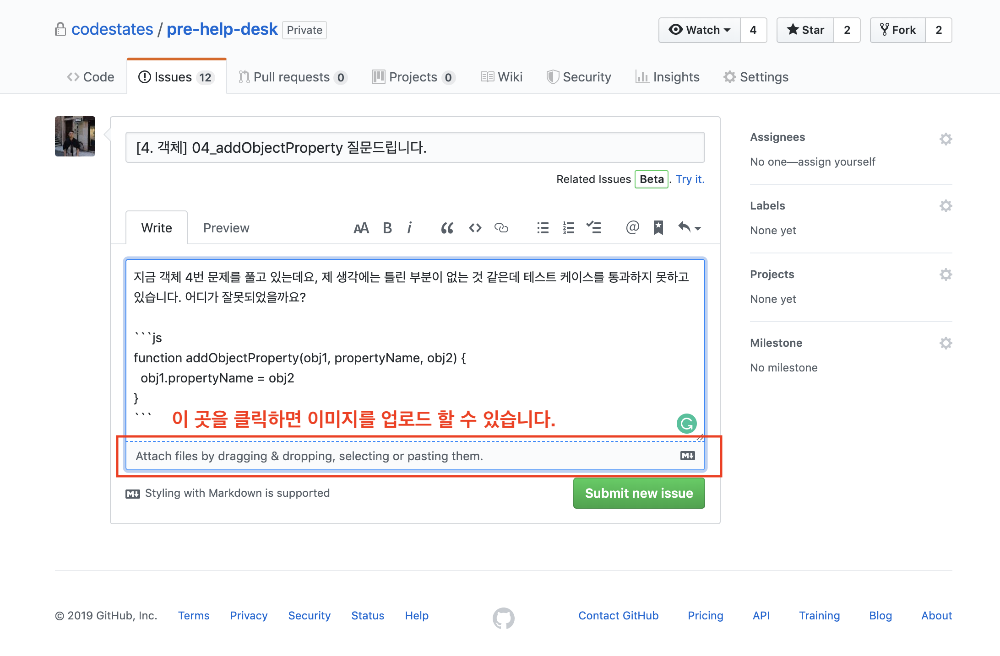
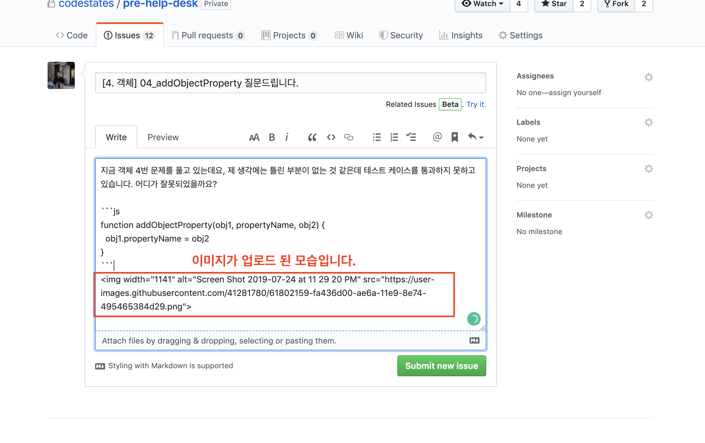
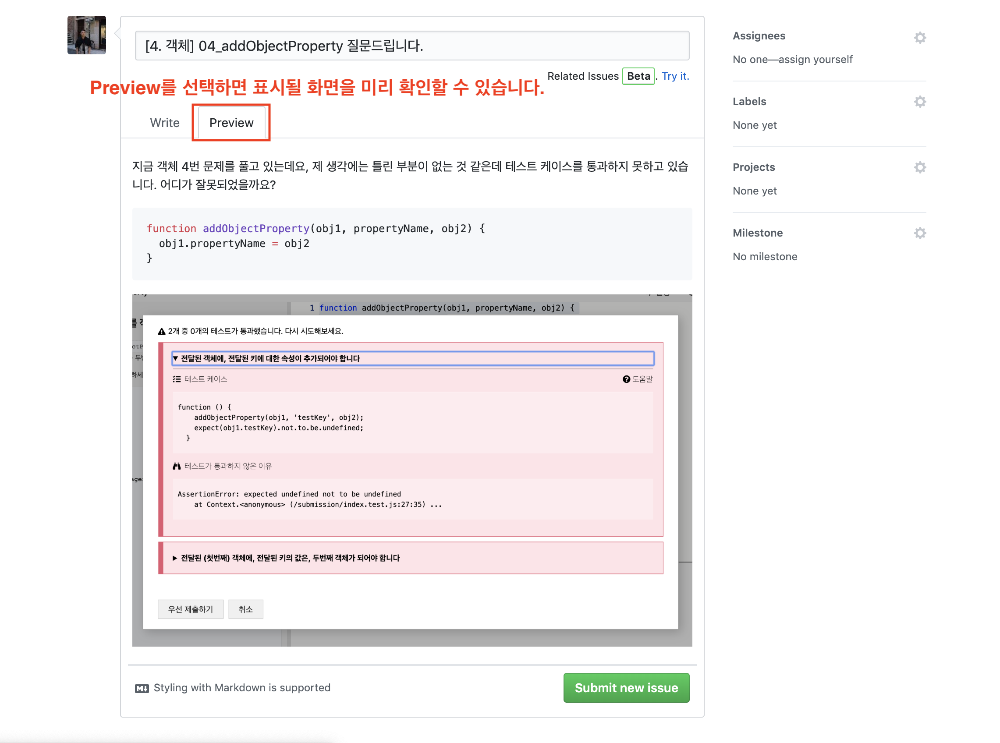

👀qna 게시판에 오신 것을 환영합니다👀

[Issues](https://github.com/encore-playdata/qna/issues) 탭을 클릭하면 질문을 남길 수 있습니다!


### 1. 질문 제목을 적어주세요

`New issue` 버튼을 누르면 아래와 같이 새로운 질문을 작성할 수 있는 창이 뜹니다.



우선 질문의 제목을 입력합니다.


### 2. 질문 본문 작성하기

다음은 본문을 작성합니다.



### 3. 코드 작성하기

코드를 입렵해야한다면, 꼭 ` ```js ``` ` 블럭 안에 입력해주세요.



### 4. 이미지 업로드하기

질문에 이미지를 첨부하고 싶다면, 글을 작성하는 곳 바로 밑을 클릭합니다.



이미지를 업로드하는 창에서 이미지를 선택하면, 업로드가 진행됩니다.



### 5. 미리보기

질문의 내용을 다 작성했다면, `Preview`를 눌러 생각대로 질문이 잘 표시될지 확인합니다.



### 6. 라벨 달기

질문에 라벨을 달면 라벨별로 편하게 검색을 할 수 있습니다.
나중에 다른 분들이 어려움에 처했을 때 여러분들의 질문을 보고 도움을 얻을지도 모릅니다.
함께 학습하는 다른 분들을 위해 꼭 라벨을 달아주세요!

* 먼저, 글 작성하는 곳 우측에 있는 `Label`을 클릭합니다
* 다음 문제 제목을 검색하고 맞는 라벨을 달아줍니다.


### 7. 질문을 만듭니다.

위의 단계를 모두 완료했다면, `Submit new issue` 버튼을 클릭해 질문을 만들어 주시면 됩니다!


## Markdown 사용법
헬프데스크 게시글을 작성하실 때 우리는 [markdown](https://gist.github.com/ihoneymon/652be052a0727ad59601)이라는 문법 형식을 사용해서 글을 작성합니다. markdown 문법 들 중 우리가 헬프데스크를 사용하는데 꼭 필요한 것들만 살펴봅시다!

### 1. 글씨 크기 조절하기
markdwon을 사용해 6가지의 글씨 크기를 표현할 수 있습니다.
```
# 제일큼
## 두번째
### 세번째
#### 네번째
##### 다섯번째
###### 여섯번째
```

# 제일큼
## 두번째
### 세번째
#### 네번째
##### 다섯번째
###### 여섯번째

### 2. 글씨 강조하기
markdown을 사용하면 쉽게 글씨를 강조할 수 있습니다.
```
*기운 글씨*
**두꺼운 글씨**
```
*기운 글씨*

**두꺼운 글씨**

### 3. 리스트 형식
리스트 형식으로 표현할 수 있습니다.
```
1. 첫 번째
2. 두 번째
3. 세 번째

* 순서 없음
* 순서 없음
* 순서 없음
```

1. 첫 번째
2. 두 번째
3. 세 번째

* 순서 없음
* 순서 없음
* 순서 없음


### 4. 코드 예쁘게 쓰기 ☜（ﾟ∀ﾟ☜） 중요!
여러분이 올린 질문을 읽을 사람들을 위해 예쁘게 정리 된 코드를 입력해주세요! ` ```js ``` ` block을 활용해보세요!

<pre>
```js
이 안쪽에 코드를 넣으면 코드가 예쁘게 보입니다.

let 식상한_문구 = 'Hello World!'

console.log(식상한_문구) // 'Hello World!'
```
</pre>
```js
// 출력되는 코드!

let 식상한_문구 = 'Hello World!'

console.log(식상한_문구) // 'Hello World!'
```

여러분들도 markdown을 사용해 헬프데스크 게시물을 **많이 많이** 올려주세요! （●＞ω＜●）
