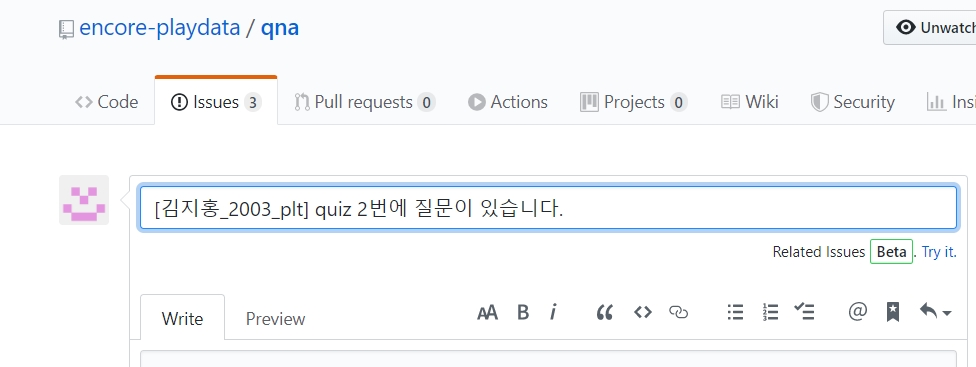
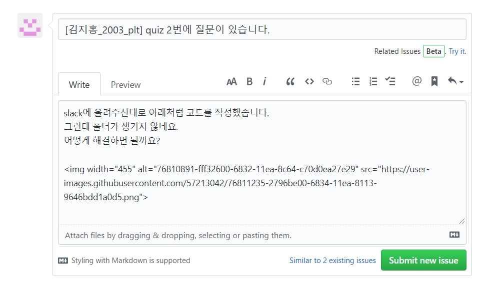
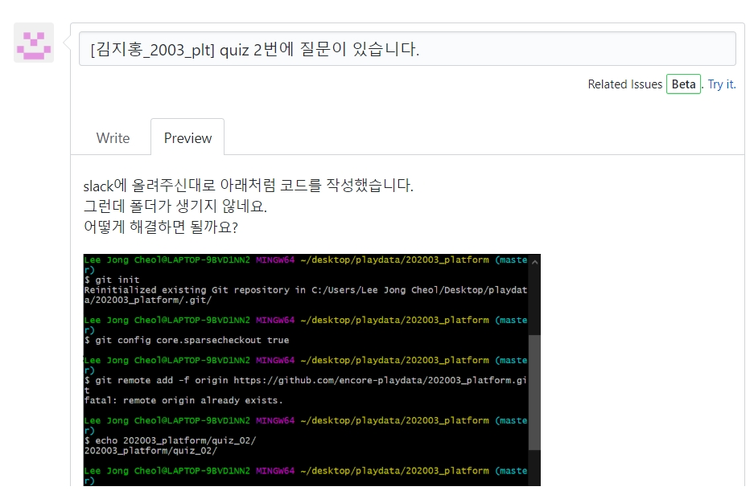

# qna 게시판 안내
 

#### 안녕하세요 플레이데이터입니다 😁
#### 프로그래밍을 공부하다가 궁금한 점이 있으면 여기 repo에 질문해주세요! 
#### 질문을 올리시면 자동으로 슬랙으로 공유됩니다. 
  

## 질문은 어떻게 하면 되나요?
### 1. 상단메뉴 두번째 탭 Issues를 클릭하세요.

 

### 2. 'New Issue' 버튼을 클릭하세요. 

 

### 3. 질문의 제목을 적어주세요. 

`New issue` 버튼을 누르면 아래와 같이 새로운 질문을 작성할 수 있는 창이 뜹니다. 
맨 위에 있는 빈칸에 질문할 내용의 제목을 입력합니다. 
이때 반드시 **[이름_연월_과정] 질문 제목** 형식으로 작성해주세요.

 

### 4. 질문 내용 작성하기

질문할 내용을 작성합니다. 
최대한 상세하게 적어주세요.  
스크린샷과 코드도 넣을 수 있습니다. 

 

### 5. 미리보기

`Preview` 탭을 눌러 질문이 잘 작성되었는지 확인하세요.

 

### 6. 질문을 제출해주세요.

`Submit new issue` 버튼을 클릭하면 질문을 제출할 수 있습니다.  
제출하신 질문은 자동으로 슬랙에도 공유됩니다. 

